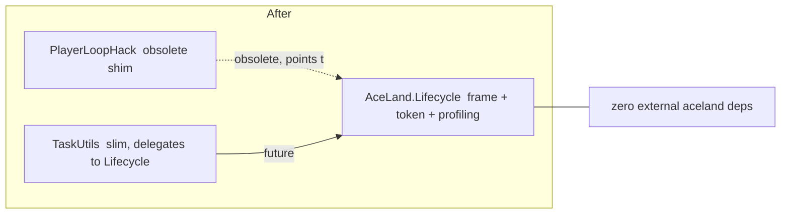

# AceLand.Lifecycle — 開發 Roadmap

> 目標：讓 Lifecycle「如其名」——不只管理初始化與結束，還完整掌管 **frame 級別的排程與等待原語**，並提供 **初始化診斷 / profiling** 與 **平行初始化**。
> 相依策略：Lifecycle 走 **零外部相依、自足（self-contained）** 路線，直接以低階 `PlayerLoop` API 自建 frame 驅動；`PlayerLoopHack` 標記 obsolete 但保留；`TaskUtils` 日後精簡，能重用 Lifecycle 的地方改指向 Lifecycle。

---

## 0. 需求對照表

| # | 需求 | 對應 Phase |
|---|------|-----------|
| A | 初始化診斷 / Profiling（每模組 + 每階段耗時，Editor timeline 視覺化） | Phase 3 ✅（匯出暫緩） |
| B | 平行初始化（同階段無依賴者併發，含 per-phase / per-module timeout） | Phase 2 |
| C | Frame agents（`RunOnNextFrame` / `RunAfterFrames` …，回傳可 `using` / `await` 的 IDisposable） | Phase 1 |
| D | 更多 token / awaitable（frame token、`WaitUntil` / `WaitWhile` / `WaitForNextFrame` …） | Phase 1 |
| E | 評估 `PlayerLoopHack` 併入（決策：併入 + 原套件 mark obsolete） | Phase 0 |
| F | Lifecycle Graph 移除重複的 Quit 面板（Quit 交由 Quit Pipeline 視窗） | Phase 2.5 |
| G | 新增 PlayerLoop 視窗：只顯示 Lifecycle 注入的節點與其狀態 | Phase 2.5 |
| H | Deep Profiling：整合 Unity Profiler（`ProfilerMarker`）+ dev build 內存取 timeline 資料 | Phase 5 ⏸ Pending |

---

## 1. 架構決策（已與使用者定案）

1. **Frame 驅動來源**：Lifecycle 自建 `LifecyclePlayerLoop`（內部以 `UnityEngine.LowLevel.PlayerLoop` 注入一個 update 節點）。不相依 `PlayerLoopHack`。
2. **`PlayerLoopHack`**：保留於 registry（已 publish、已有用家），但整個 public API 加 `[Obsolete]` 指向 Lifecycle 對應功能；不再擴充。
3. **`TaskUtils`**：本輪不動；roadmap 只登記「未來精簡方向」——把 `WaitUntil` / `WaitForSeconds` / Dispatcher / `ApplicationAliveToken` 等改為委派或標 obsolete 指向 Lifecycle。internal 有用邏輯（如 dispatcher queue）搬入 Lifecycle。
4. **相依方向**：`Lifecycle`（底層、零相依） ← `TaskUtils` ← `Injection` … 單向；Lifecycle 不可反向相依任何 aceland 套件。
5. **決定性優先**：新增的平行初始化必須「預設關閉」或「可宣告 opt-in」，確保現有純同步專案行為完全不變。
6. **CoreCLR / 不再自動 reload domain 為大前題**：Unity 已進入 CoreCLR 階段，未來 Domain 不會自動 reload。因此所有 static 狀態與注入 PlayerLoop 的 delegate 都必須顯式清理，不得倚賴 domain reload 復位。所有殘留物（PlayerLoop 節點、排程佇列、token、事件訂閱）必須在 `ResetStatics` / 結束流程中主動移除。
7. **殘留物自動處理**：PlayerLoop 注入的 delegate 於 Quit 時、等待 blocker 期間自動偵測並清理；Editor 執行時（進出 Play、重編譯）尤其嚴格。詳見 §5。

---

## 2. 命名 / API 草案

> 命名可再議；以下為 roadmap 討論基準。所有非同步方法皆接受 `CancellationToken`，並盡量提供可 `await` 與可 `using`（IDisposable handle）兩種用法。

### 2.1 Frame 排程（Phase 1）— `LifecycleFrame`（static）

| 建議 API | 說明 | 回傳 |
|----------|------|------|
| `RunNextFrame(Action)` | 下一幀執行一次 | `IFrameHandle`（IDisposable，可取消 / 可 await 完成） |
| `RunAfterFrames(Action, int frames)` | 延後 N 幀執行一次 | `IFrameHandle` |
| `RunAfterFrames(Action, int frames, PlayerLoopPoint point)` | 指定在 player loop 哪個時點 | `IFrameHandle` |
| `RunWhen(Func<bool> predicate, Action)` | 條件成立當幀執行一次 | `IFrameHandle` |
| `RunEveryFrame(Action, int? maxFrames)` | 每幀執行（可選上限），常用於暫時性 pump | `IFrameHandle` |
| `RunDelayed(Action, float seconds)` | 以 unscaled/scaled time 延遲（旗標可選） | `IFrameHandle` |

> 命名建議：原提案 `RunOnNextFrame` → `RunNextFrame`；`RunAfterFrams`（typo）→ `RunAfterFrames`。追加 `RunWhen` / `RunEveryFrame` / `RunDelayed`。

`IFrameHandle`：
- `: IDisposable`（Dispose = 取消排程）
- 可 `await handle;`（透過自訂 awaiter 或 `handle.AsTask()` 於動作執行完成時完成）
- 屬性：`IsCompleted` / `IsCancelled`

### 2.2 Token / Awaitable（Phase 1）— 擴充 `LifecycleToken`

| 建議 API | 說明 |
|----------|------|
| `CreateCurrentFrameToken()` | 本幀結束（該時點 pump 尾）自動 cancel |
| `CreateFrameToken(int frames)` | N 幀後自動 cancel（原 `CreateSkipFrameToken`） |
| `WaitForNextFrame(CancellationToken = default)` | await 到下一幀 |
| `WaitForFrames(int frames, CancellationToken = default)` | await N 幀（原 `WaitForFrameCount`） |
| `WaitUntil(Func<bool>, CancellationToken = default)` | await 直到條件為 true（每幀評估，非 thread） |
| `WaitWhile(Func<bool>, CancellationToken = default)` | await 直到條件為 false |
| `WaitForSeconds(float, bool unscaled = false, CancellationToken = default)` | await 秒數（於主執行緒 frame pump 上計時） |

> 命名建議：`CreateSkipFrameToken` → `CreateFrameToken`；`WaitForFrameCount` → `WaitForFrames`。
> **定案（for insurance）**：所有產出的 token / awaitable 一律 **linked with `ApplicationAlive`**——無論呼叫端是否傳入自己的 `CancellationToken`，內部都與 `ApplicationAlive`（及 `Quitting`）token linked，確保應用結束 / 進出 Play / 重編譯時 **必定被 cancel**，杜絕殘留的等待卡死；並在 `ResetStatics` 回收。`WaitForSeconds` 同時支援 scaled / unscaled（`unscaled` 旗標，預設 `false` = scaled）。
> 重點：這些 `WaitUntil` / `WaitWhile` 以 **frame pump 主執行緒輪詢** 實作，而非 `TaskUtils` 那種 `Task.Run` + `Task.Delay(50)` 背景執行緒版本 —— 更精準、可存取 Unity API、無執行緒切換成本。

### 2.3 平行初始化（Phase 2）— 以 attribute 設定（定案）

- **設定入口統一走 attribute**（不做 project settings）：
  - `LifecycleModuleAttribute` 追加：`AllowParallel`（bool，預設 `false`）與可選 `TimeoutMs`（per-module）。
  - Phase 級設定用 assembly attribute：`[assembly: LifecyclePhaseOptions(ModulePhase.Runtime, Parallel = true, TimeoutMs = 5000)]`。
- `ModuleRegistry.RunPhaseInternal` 改為：拓撲排序後切成「相依層級（levels）」，同一 level 且皆 `AllowParallel` 的 async 模組 `Task.WhenAll` 併發；同步模組維持順序。
- Timeout：per-module 逾時 → 標 `Failed`（不阻斷整體）；per-phase 逾時 → 記 issue 並強制往前（延續現有 quit pipeline 的「永不卡死」哲學）。

### 2.4 Profiling / 診斷（Phase 3）— `LifecycleProfiler`（可選啟用 + runtime 開關）

- 每個 `ModuleEntry` 已有 `InitMilliseconds`；擴充為 `StartedAtMs` / `EndedAtMs`（相對初始化起點）與 async 段落細分。
- 新增 `PhaseTimingInfo`（phase 起訖、模組數、併發批次）。
- `ModuleRegistry` 收集為 `LifecycleTimeline`（可透過 `GetTimeline()` 取得）。
- **啟用策略（定案）**：預設「Editor + development build 開、release 關」；並提供 **runtime online 開關 API**——`LifecycleProfiler.Enabled { get; set; }`（可於執行期即時開 / 關收集），關閉時零成本、不再累積 timeline 資料。
- Editor：新增 `InitializationTimelineWindow`（甘特圖式 timeline，色彩依 phase，async 段可視、逾時 / 失敗標紅），並可與現有 `DependencyGraphWindow` 互相跳轉。

---

## 3. 分階段計畫（Phases）

### Phase 0 — 基礎：自建 PlayerLoop 驅動 + 決策落地

**產出**
- `Runtime/PlayerLoop/LifecyclePlayerLoop.cs`（internal）：以 `PlayerLoop.GetCurrentPlayerLoop` 注入 update 節點，提供「每幀 tick」給上層 pump 使用；**CoreCLR 前題：不倚賴 domain reload**，一律在 `ResetStatics` 與結束流程顯式移除節點。
- `Runtime/PlayerLoop/PlayerLoopPoint.cs`（public enum，對應 TimeUpdate/Update/PreLateUpdate/PostLateUpdate 等，供 frame API 指定注入點）。
- **殘留物自動清理機制（定案）**：
  - 於 Quit 流程 / 等待 blocker 期間，主動掃描並移除 Lifecycle 注入的 PlayerLoop 節點與排程佇列殘留（延續 `ApplicationQuitPipeline` 的 blocker-wait 迴圈，於其中掛清理 hook）。
  - **Editor 執行**：訂閱 `EditorApplication.playModeStateChanged` 與 `AssemblyReloadEvents.beforeAssemblyReload`，在退出 Play / 重編譯前先移除節點，避免累積多個 update delegate。
  - 提供 idempotent 的 `LifecyclePlayerLoop.EnsureRemoved()`，多次呼叫安全；並可 self-heal（偵測到當前 PlayerLoop 已無我方節點時重置狀態旗標）。
- 決定：`LifecycleHost.CoroutineRunner` 仍保留，但 frame 排程改走 PlayerLoop（不需 MonoBehaviour）。
- `PlayerLoopHack`：對 `IPlayerLoopSystem` / `PlayerLoopExtensions` / `PlayerLoopState` 加 `[Obsolete("Use AceLand.Lifecycle ...", false)]`（warning 級，不破壞編譯），更新其 README / CHANGELOG 標示 deprecated。

**驗收**：Play 進入後可觀察到 Lifecycle 的 player loop 節點；Quit / 離開 Play / 重編譯（含關閉 domain reload 的設定）後節點乾淨移除、無殘留 delegate、無洩漏 log；重複進出 Play 節點數量恆定。

---

### Phase 1 — Frame 排程 + Token / Awaitable（需求 C、D）

**產出**
- `Runtime/Frame/IFrameHandle.cs`、`FrameHandle.cs`（IDisposable + awaiter）。
- `Runtime/Frame/FrameScheduler.cs`（internal，掛在 `LifecyclePlayerLoop` 上，維護排程佇列，主執行緒 pump）。
- `Runtime/Frame/LifecycleFrame.cs`（public static，§2.1 API）。
- 擴充 `LifecycleToken`：§2.2 的 frame token 與 wait awaitable。
- 統一以 `ApplicationAlive` / `Quitting` token linked，確保結束時全部 cancel。

**驗收**：sample 場景示範 `using (LifecycleFrame.RunAfterFrames(...))`、`await LifecycleToken.WaitForNextFrame()`、`await LifecycleToken.WaitUntil(...)`；結束 / domain reload 不卡死、無洩漏。

---

### Phase 2 — 平行初始化（需求 B）

**產出**
- `LifecycleModuleAttribute` 追加 `AllowParallel` / `TimeoutMs`。
- Phase 級平行 / timeout 設定機制：assembly attribute `[assembly: LifecyclePhaseOptions(...)]`（定案：走 attribute，不做 project settings）。
- `ModuleSorter` 輸出「level 分層」資訊；`ModuleRegistry.RunPhaseInternal` 支援同層併發 + per-module / per-phase timeout。
- 保持預設關閉（opt-in），純同步專案零行為變更。
- 更新 `ModuleSorterTests` + 新增併發 / timeout 測試。

**驗收**：含人工延遲的 async 模組在標 `AllowParallel` 後，phase 總耗時明顯下降；timeout 行為正確（標 Failed、不阻斷、記 issue）。

---

### Phase 2.5 — Editor 視窗整理（需求 F、G）

> 由使用者於 Phase 2 驗收後提出的兩項可行改善，皆屬 Editor-only、不影響 runtime 行為與對外 API。

**F. Lifecycle Graph 移除重複的 Quit 面板**
- `DependencyGraphWindow` 底部的 Quit 面板（`_quitPanel` / `_showQuitPanel` / splitter）與獨立的 `QuitPipelineWindow` 內容重複。
- 產出：移除 Graph 視窗內嵌的 Quit 面板與相關 toolbar toggle / splitter 拖曳邏輯；Quit 資訊統一由 `QuitPipelineWindow` 呈現。
- Graph 視窗釋出的垂直空間全部給圖面；`QuitPanel.cs` 若不再被 Graph 使用可保留供 `QuitPipelineWindow` 重用或視情況清理。
- 保留 Graph 節點上既有的 Quit 標記（quit handler / blocker badge），僅移除「面板」本身。

**G. 新增 PlayerLoop 視窗（只顯示 Lifecycle 注入節點）**
- 新視窗 `PlayerLoopWindow`（`Tools/AceLand/Lifecycle/Player Loop`），只列出 **經 Lifecycle 注入** 的 PlayerLoop 節點；Unity 內建或非經 Lifecycle 注入的節點一律不顯示。
- 資料來源：`LifecyclePlayerLoop` 追加 internal 查詢 API（例如 `EnumerateInstalled()` 回傳各 `PlayerLoopPoint` 是否已注入 / 是否在當前 loop 中偵測到 marker），供 Editor 反射當前 `PlayerLoop.GetCurrentPlayerLoop()` 比對。
- 每個節點顯示：`PlayerLoopPoint`、掛載的 Unity 父段（如 `Update` / `PreLateUpdate`）、是否 installed、是否 self-heal 過、以及該點目前 `FrameScheduler` bucket 內的 handle 數（可選）。
- 即時更新：如同其他視窗訂閱 `EditorApplication.update`，Play 模式下定期 repaint；顯示 install/remove 狀態變化。
- 保持唯讀（診斷用途），不提供手動 install/remove 按鈕以免破壞決定性；可選提供「Refresh」。

**驗收**：Graph 視窗不再顯示重複 Quit 面板；PlayerLoop 視窗於 Play 中可見 Lifecycle 注入的各點與狀態，進出 Play / 重編譯後節點列表正確反映（install→remove），且不列出 Unity 內建節點。

---

### Phase 3 — 初始化診斷 / Profiling（需求 A）✅ 批次一 + 批次二已交付（匯出暫緩）

**產出**
- ✅ **批次一（runtime）**：`ModuleEntry` timing 埋點（`StartedAtMs` / `EndedAtMs` + sync / async 兩段）；`ModuleTimingInfo` / `PhaseTimingInfo` / `LifecycleTimeline` 資料模型（`Runtime/Profiling/`）；`LifecycleProfiler`（`Enabled` runtime online 開關，預設 Editor + dev build 開、release 關，關閉時零成本）；`ModuleRegistry.GetTimeline()`。
- ✅ **批次二（Editor）**：`InitializationTimelineWindow`（甘特圖：phase 色彩、sync 實心 / async 淺色段、逾時 / 失敗標紅、Live 更新、縮放、階段圖例與選取模組檢視）；與 `DependencyGraphWindow` 雙向互跳（`FocusModule` / `FocusNode`，右鍵選單）。
- ⏸ **批次三（暫緩）**：匯出 timeline（json / csv）供離線分析——依使用者範圍決定暫緩。

**驗收**：Play 後開視窗可見各 phase / 模組時間軸，async 併發段可視，逾時 / 失敗標紅，可點擊跳原始碼。

---

### Phase 4 —（未來，另開任務）TaskUtils 精簡

**方向（本輪僅登記，不實作）**
- `TaskUtils` 的 `WaitUntil` / `WaitForSeconds` 改為委派 Lifecycle，或標 `[Obsolete]` 指向 `LifecycleToken`。
- `ApplicationAliveToken` 統一為 Lifecycle 的 token 來源，移除 `ApplicationAliveSystem` 重複實作。
- Dispatcher（每 `PlayerLoopState` 的主執行緒佇列）評估搬入 Lifecycle 的 `FrameScheduler` 或以其為底重寫。
- 更新 `Injection.EntryPointRunner` 未來可選改用 Lifecycle 的 frame / async 機制（非必須）。

---

### Phase 5 —（未來，Pending）Deep Profiling / Unity Profiler 整合（需求 H）⏸

> 背景：現時 `LifecycleProfiler` 為自製 `Stopwatch` 計時器，Editor + development build 預設開、release 關；資料經 `ModuleRegistry.GetTimeline()` 取得，`InitializationTimelineWindow` 為 Editor-only 視覺化，並支援匯出 JSON / CSV。使用者確認**目前使用已足夠，本項暫緩（Pending）**，僅登記方向，待日後有需要再開任務。

**現況限制**
- 全套件**未使用** Unity `ProfilerMarker` / `Profiler.BeginSample` / `Unity.Profiling`；無法在 Unity Profiler window 或 deep profiling 中看到 Lifecycle 的自訂區段。
- Timeline 視窗與其餘 graph（Initialization / Player Loop / Quit Pipeline / Injection）皆 `EditorWindow`、Editor-only，**build 內無法檢視**；dev build 雖有收集 timeline 資料，但無 runtime UI。

**方向（本輪僅登記，不實作）**
1. **Unity Profiler 整合（`ProfilerMarker`）**
   - 於各 phase / module 執行點包上 `ProfilerMarker`（`Unity.Profiling`），命名如 `AceLand.Lifecycle/Phase/<PhaseName>`、`AceLand.Lifecycle/Module/<Name>`。
   - 以 `#if ENABLE_PROFILER`（或 `UNITY_EDITOR || DEVELOPMENT_BUILD`）條件編譯，release build 零成本。
   - 使 Unity Profiler window 與 deep profiling 能觀察 Lifecycle 自訂 marker，並可對照現有 timeline 資料。
   - 可選：發出 `ProfilerCounter` 呈現 phase 耗時 / module 數等指標。
2. **Dev build 內存取 timeline 資料**
   - 因 dev build 已收集 timeline，可做 runtime overlay / HUD，或把 `GetTimeline()` 結果序列化輸出。
   - 重用現有 `LifecycleTimelineExporter` 的序列化邏輯，但需將其由 `Editor` 組件搬至 Runtime（或抽出無 Editor 相依的核心）才能於 build 呼叫。

**決策**：Pending（使用者於現階段確認不需要）。開工前先確認範圍（是否兩項都做、marker 命名規範、conditional 編譯符號）。

**驗收（日後）**：dev build 於 Unity Profiler 可見 Lifecycle 自訂 marker（含 deep profiling）；如做第 2 項，build 內可取得 / 輸出 timeline 資料且 release build 零成本。

---

## 4. 相依關係圖

---

## 5. 風險與注意事項

1. **CoreCLR / 無 domain reload 為大前題**：未來 Domain 不會自動 reload，**不得倚賴 domain reload 清理任何 static 或注入的 delegate**。所有殘留物必須顯式移除（見下列 2）。
2. **PlayerLoop 殘留 delegate 的自動清理**（定案的緩解措施）：
   - **Quit / 等待 blocker 期間**：在 `ApplicationQuitPipeline` 的 blocker-wait 迴圈掛清理 hook，主動移除 Lifecycle 的 PlayerLoop 節點與排程佇列殘留。
   - **Editor**：訂閱 `playModeStateChanged`（`ExitingPlayMode`）與 `AssemblyReloadEvents.beforeAssemblyReload`，先行移除節點；避免重編譯 / 進出 Play 累積多個 update delegate。
   - **Idempotent + self-heal**：`EnsureRemoved()` 可重複呼叫；偵測當前 PlayerLoop 已無我方節點時自動重置旗標。
   - 驗收以「重複進出 Play，節點數量恆定、無殘留」為準。
3. **平行初始化的決定性**：務必 opt-in，且平行僅限「同拓撲層 + 皆標 AllowParallel + 皆 async」；同步模組永遠順序執行。
4. **frame awaitable 的執行緒親和性**：`WaitUntil` / frame token 只能在主執行緒 pump 評估；文件需明確標示不可用於背景 thread 的 predicate。所有 token 皆 linked with `ApplicationAlive`，結束時必被 cancel（for insurance），杜絕殘留等待。
5. **Obsolete 不破壞現有用家**：`PlayerLoopHack` 用 warning 級 `[Obsolete]`，保留完整行為一輪，待下個 major 才考慮移除。
6. **命名對外 API 一次定案**：frame / token API 一旦 publish 難改；命名已定案（見 §7）。

---

## 6. 決策定案（開放問題已全數確認）

| # | 議題 | 決策 |
|---|------|------|
| 1 | 命名 | **採用提案命名**：`LifecycleFrame` / `IFrameHandle` / `CreateFrameToken` / `WaitForFrames` 等（見 §2.1 / §2.2）。 |
| 2 | 平行初始化設定入口 | **走 attribute**（module 級 `AllowParallel` + assembly 級 `LifecyclePhaseOptions`）；不做 Project Settings。 |
| 3 | Profiler 啟用方式 | 預設「Editor + development build 開、release 關」；**追加 runtime online 開關** `LifecycleProfiler.Enabled`。 |
| 4 | `WaitForSeconds` 時間基準 | **同時支援 scaled / unscaled**（`unscaled` 旗標，預設 scaled）。 |
| 5 | 實作順序 | **依 Phase 0 → 1 → 2 → 3 逐步進行**。 |
| 6 | Token 保險 | 所有產出 token **linked with `ApplicationAlive`**（for insurance），結束必 cancel。 |
| 7 | 殘留物處理 | Quit / blocker-wait 期間 + Editor 進出 Play / 重編譯前自動清理 PlayerLoop delegate；以 CoreCLR 無 domain reload 為前題。 |

> 下一步：切換至 Code 模式，從 Phase 0 開始實作。
