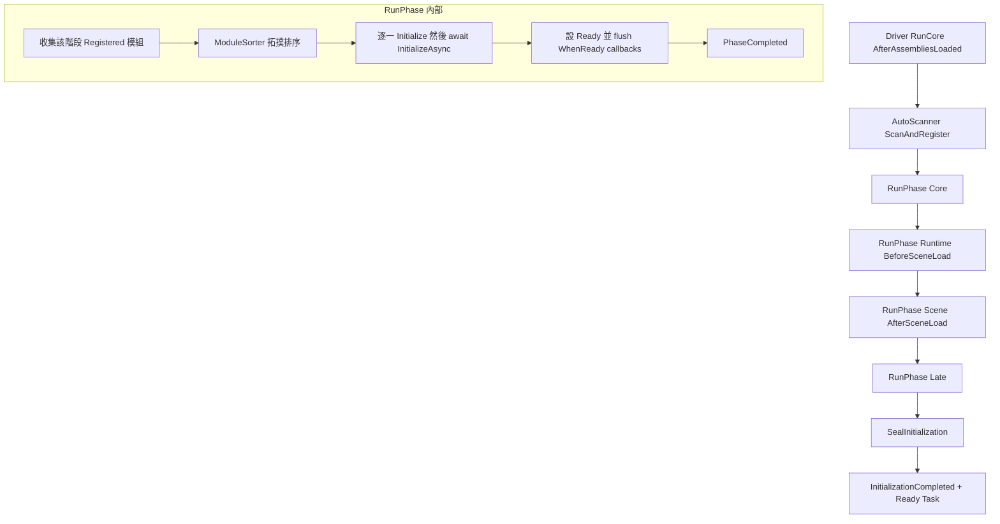
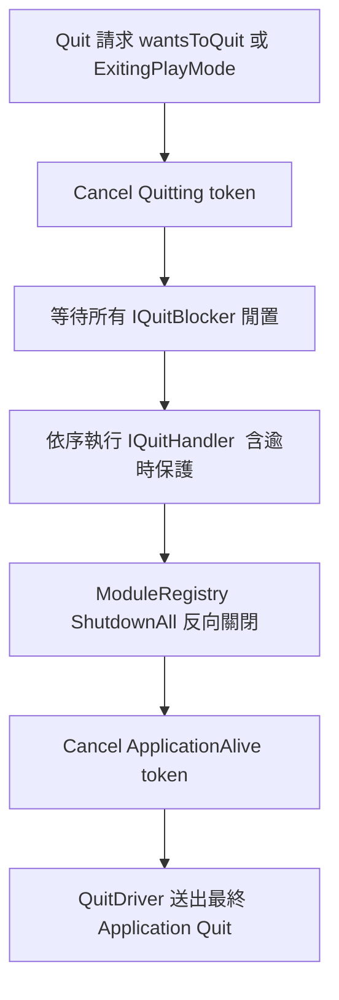

# AceLand.Lifecycle — 結構文件

> 版本：`0.2.5`（beta published）
> Unity 最低版本：`2022.3`
> 用途：為 Unity 專案提供 **決定性、依賴排序的全域初始化流程**，以及 **統一的結束（Quit）管線**。
> 核心理念：Attribute 只負責「登記」，真正的執行順序由拓撲排序（topological sort）決定。

---

## 1. 套件定位與核心理念

`AceLand.Lifecycle` 解決兩大問題：

1. **初始化順序混亂**
   傳統 Unity 用 `[RuntimeInitializeOnLoadMethod]`、`Awake`、`Start` 等零散手段，順序難以掌控且無法表達模組間的依賴關係。
   本套件讓每個模組用 `[LifecycleModule]` 宣告自己的「階段（Phase）」與「依賴（DependsOn）」，由 `ModuleSorter` 做拓撲排序後決定實際執行順序。

2. **結束流程分散**
   原本散落各處的 `SafeToClose` / `Playground.IsFree` 邏輯，統一成 `ApplicationQuitPipeline`：等待忙碌的 blocker、依序跑收尾 handler、關閉所有模組、最後才真正離開。

設計上的關鍵約束：
- **Attribute 只登記，不決定順序** — 順序完全由依賴關係 + Order 決定。
- **三方一致性** — 用 `typeof(...)` 表達依賴 → asmdef 必須 reference → package.json 必須宣告依賴，三者自動保持一致。
- **同步模組不可依賴非同步模組** — Validator 會報錯（見 §6）。
- **Domain Reload 關閉時可正確重置** — 所有 static 皆有 `ResetStatics()`。

---

## 2. 目錄結構總覽

```
com.aceland.lifecycle/
├── package.json                    套件描述（v0.2.5）
├── CHANGELOG.md
├── README.md / LICENSE
│
├── Runtime/                        執行期程式碼（AceLand.Lifecycle asmdef）
│   ├── Contracts/                  對外契約（介面 / 結構）
│   │   ├── IModule.cs              IModule / IAsyncModule / ModuleBase / AsyncModuleBase
│   │   ├── InitializationResult.cs 初始化總結（Total/Ready/Failed/Skipped/ms）
│   │   └── IQuitHandler.cs         IQuitHandler / IQuitBlocker / QuitContext / QuitOrderAttribute
│   │
│   ├── Attributes/
│   │   └── LifecycleAttributes.cs  LifecycleModuleAttribute / LifecycleAssemblyAttribute
│   │
│   ├── ModulePhase.cs              執行階段列舉（Core/Runtime/Scene/Late）
│   ├── ModuleState.cs              模組狀態列舉（Declared→Registered→…→ShutDown）
│   ├── ModuleEntry.cs              單一模組登記項（唯讀對外，含 timing 埋點）
│   ├── ModuleRegistry.cs           ★ 核心：登記、排程、執行、查詢、關閉、GetTimeline()
│   ├── ModuleSorter.cs             單一階段內的拓撲排序（含循環偵測）
│   ├── ModuleAutoScanner.cs        反射掃描 + 自動登記
│   │
│   ├── Profiling/                  初始化診斷（Phase 3）
│   │   ├── LifecycleProfiler.cs    Enabled 開關（Editor+dev on/release off）+ 執行期切換
│   │   ├── PhaseTimingInfo.cs      單一階段耗時彙總（起訖 ms、模組數、逾時旗標）
│   │   ├── ModuleTimingInfo.cs     單一模組耗時（起訖 ms、sync/async 兩段、問題旗標）
│   │   └── LifecycleTimeline.cs    整趟初始化時間軸快照（各 Phase + Module）
│   │
│   ├── LifecycleDriver.cs          驅動器（Legacy：Unity < 6000.5）
│   ├── LifecycleDriver.Unity65..cs 驅動器（Unity 6.5+ partial）
│   ├── LifecycleDriverShared.cs    兩版驅動器共用邏輯（Reset / Verify）
│   │
│   ├── ApplicationQuitPipeline.cs  ★ 統一結束管線
│   ├── QuitDriver.cs               負責最終 Application.Quit() 的 MonoBehaviour
│   │
│   ├── LifecycleToken.cs           全域 CancellationToken 中樞 + LinkedTokenSource
│   ├── LifecycleHost.cs            場景物件宿主 GameObject + Host Behaviour
│   ├── LifecycleLog.cs             統一 log（可整體靜音）
│   ├── Disposable.cs               輕量 IDisposable 實作
│   └── AssemblyInfo.cs             AlwaysLinkAssembly + InternalsVisibleTo
│
├── Editor/                         編輯器工具（AceLand.Lifecycle.Editor asmdef）
│   ├── LifecycleValidator.cs       選單：驗證依賴 / 編譯後自動驗證
│   ├── ModuleGraphModel.cs         建立圖表資料（靜態掃描 + 執行期覆蓋）
│   ├── DependencyGraphWindow.cs    ★ 依賴關係視覺化視窗（809 行）
│   ├── InitializationTimelineWindow.cs ★ 初始化耗時甘特圖視窗（Phase 3）
│   ├── GraphNode.cs / GraphLayout.cs  節點資料 / 佈局演算
│   ├── QuitPanel.cs                Quit 計畫顯示面板
│   ├── QuitPipelineWindow.cs       Quit 管線視窗
│   └── ScriptLocator.cs            由型別跳轉到原始碼
│
├── Tests/
│   └── Editor/ModuleSorterTests.cs 排序器單元測試
│
└── Samples~/SampleLifecycle/       範例：各階段模組 + Quit UI
```

---

## 3. 執行期核心元件

### 3.1 契約層（Contracts）

**`IModule`** — 所有模組的基礎介面
| 成員 | 說明 |
|------|------|
| `void Initialize()` | 同步初始化，應保持輕量（通常只登記服務、設定欄位） |
| `void Shutdown()` | 反向清理，依初始化的相反順序呼叫，必須可重入（多次呼叫不出錯） |

**`IAsyncModule : IModule`** — 需要非同步初始化的模組
- `Task InitializeAsync(CancellationToken)`
- 執行順序：先 `Initialize()`（輕量登記），再 await `InitializeAsync()`；兩者都完成才算 Ready。
- **限制：同步模組不可依賴非同步模組**（否則 Validator 報錯）。

**便利基底類別**
- `ModuleBase : IModule` — 提供 virtual 空實作。
- `AsyncModuleBase : ModuleBase, IAsyncModule` — 只需實作 `InitializeAsync`。

**`InitializationResult`（readonly struct）** — 初始化總結
- `Total / Ready / Failed / Skipped / Milliseconds`
- `HasErrors => Failed > 0 || Skipped > 0`

**`IQuitHandler`** — 結束前需執行非同步收尾的模組
- `Task OnBeforeQuitAsync(QuitContext)`；預設依初始化的相反順序執行。

**`IQuitBlocker`** — 「系統忙碌中，先別結束」的阻擋器
- `bool IsBusy` / `string BusyReason`；等同原本的 `Playground.IsFree`。

**`QuitContext`** — 傳給 quit handler 的情境物件
- `Token`（ApplicationAlive，關閉過程仍存活可 await）、`StartedAtUtc`、`TimeoutSeconds`、`Elapsed`、`Remaining`、`IsTimedOut`、`Status`、`SetStatus()`。

**`QuitOrderAttribute`** — 調整 `IQuitHandler` 執行順序（數值越小越先，未標示為 0）。

### 3.2 Attributes

**`LifecycleModuleAttribute`（用於 class）** — 模組的核心宣告
| 屬性 | 說明 |
|------|------|
| `Phase`（建構參數） | 執行階段 |
| `Order` | 同一依賴層級內的 tie-break，越小越先，預設 0 |
| `DependsOn` | 依賴的模組型別陣列（用 `typeof`） |
| `Id` | 登記 Id，留空用型別本身；用於以介面對外揭露模組時 |
| `AutoRegister` | 是否由 `ModuleAutoScanner` 自動 new + 登記（需 public 無參數建構子），預設 `true` |

**`LifecycleAssemblyAttribute`（用於 assembly）** — 讓自動掃描器願意掃描此組件
- 未標示的組件永不被反射，避免啟動時掃描整個專案。

### 3.3 列舉

**`ModulePhase`** — 嚴格分階段，前一階段完全結束才進下一階段
| 階段 | 值 | 對應 Unity 時機 | 用途 |
|------|----|----|------|
| `Core` | 0 | AfterAssembliesLoaded | 純 C#，不碰 UnityEngine 物件 |
| `Runtime` | 1 | BeforeSceneLoad | 可用 UnityEngine API，但尚無場景物件 |
| `Scene` | 2 | AfterSceneLoad | 需要既有場景 / 建立 GameObject |
| `Late` | 3 | AfterSceneLoad 之後 | 最終收尾（分析、暖身、開場流程） |

**`ModuleState`**
`Declared`(0，僅編輯器靜態掃描時) → `Registered`(1) → `Initializing`(2) → `Ready`(3) / `Failed`(4) / `Skipped`(5，依賴未就緒) → `ShutDown`(6)。

### 3.4 登記與排程核心

**`ModuleEntry`** — 單一模組的執行期登記項（對外唯讀，只有 registry 能改）
- 攜帶 `Id / Module / Phase / Order / DependsOn / IsAsync / AutoRegistered`
- 執行期狀態 `State / Error / InitMilliseconds / SortIndex`。

**`ModuleRegistry`（static，核心中的核心）**
- **登記**：`Register(...)` 多載（以型別或以 `TId` 介面為 Id）；手動登記可覆蓋自動掃描結果。
- **執行**：`RunPhase(phase)` → `RunPhaseInternal` 收集該階段 `Registered` 模組 → `ModuleSorter.Sort` → 依序 `Initialize()` +（若 async）await `InitializeAsync()` → 設 `Ready` → flush ready callbacks。以 `_chain`（Task）串接，讓純同步專案行為不變、async 模組也能被涵蓋。
- **事件**：`ModuleStateChanged`（不重播）、`PhaseCompleted`、`InitializationCompleted`。
- **查詢 / 取得**：`IsReady<T>`、`TryGet<T>`、`Get<T>`、`WhenReady<T>(callback)`（已 Ready 立即同步呼叫，否則排隊）、`WhenReadyAsync<T>`、`WhenInitialized(callback)`、`ObserveStates`（立即重播所有已知模組狀態，供診斷 / 編輯器視窗）。
- **狀態**：`Ready`（Task）、`IsInitialized`、`Result`、`IsPhaseCompleted`。
- **關閉**：`ShutdownAll()` 依初始化相反順序呼叫 `Shutdown()`，可重入。
- **重置**：`ResetStatics()` 供 Domain Reload 關閉時清空。

**`ModuleSorter`（internal static）** — 單一階段內拓撲排序
- 先以 `(Order, FullName)` 正規化保證決定性。
- 深度優先 + 三色標記偵測循環依賴（記錄成 issue，違規節點推到最後）。
- 排序過程同時檢查三類問題：依賴未登記、依賴在較晚階段、同步模組依賴 async 模組。

**`ModuleAutoScanner`（internal static）** — 反射掃描 + 自動登記
- 只掃描標了 `[assembly: LifecycleAssembly]` 的組件（除非定義 `ACELAND_LIFECYCLE_SCAN_ALL_ASSEMBLIES`）。
- 找出帶 `[LifecycleModule]` 且 `AutoRegister=true` 的型別，以 `FullName` 排序後 new 出來登記。
- 編輯器 / development build 會警告「有 `[LifecycleModule]` 但組件缺 `[assembly: LifecycleAssembly]`」的漏網型別。
- 可用 `ACELAND_LIFECYCLE_NO_AUTOSCAN` 完全停用。

### 3.5 驅動器（Driver）

依 Unity 版本分兩條路徑，用 asmdef 的 `versionDefines`（`ACELAND_UNITY_6_5_OR_NEWER`，門檻 `6000.5`）自動切換：

- **`LifecycleDriver.cs`（Legacy，Unity < 6000.5 或 `ACELAND_LIFECYCLE_FORCE_LEGACY`）**
  以三個 `[RuntimeInitializeOnLoadMethod]` 分別跑 Core / Runtime / Scene+Late，並 `SealInitialization()`。
- **`LifecycleDriver.Unity65..cs`（Unity 6.5+ partial）**
  額外用 `[OnCodeInitializing/Unloading/Deinitializing]`、`[OnExitingPlayMode]` 等新生命週期 hook 安裝與關閉；階段驅動仍沿用 `RuntimeInitializeOnLoadMethod`（作為階段屏障）。
- **`LifecycleDriverShared.cs`** — 兩版共用的 `ResetAll(reason)`（順序：quit hooks → modules → tokens）與 `VerifyAfterReload()`（Play 中重編譯的偵測與警告）。

### 3.6 結束管線（Quit Pipeline）

**`ApplicationQuitPipeline`（static，780 行）** — 統一結束流程
執行順序：
1. Cancel `Quitting` token（遊戲迴圈停止）
2. 等待所有 `IQuitBlocker` 變閒置（輪詢，`BLOCKER_POLL_MILLISECONDS = 50`）
3. 依序執行 `IQuitHandler`（預設 = 初始化相反順序，再依 `QuitOrder` 穩定排序）
4. `ModuleRegistry.ShutdownAll()`
5. Cancel `ApplicationAlive` token → 真正結束 / 離開 Play Mode

重點特性：
- 統一入口 `Quit()`（編輯器與 build 皆適用）；攔截 `Application.wantsToQuit` 與 `EditorApplication.playModeStateChanged`。
- 整體逾時 `TIMEOUT_SECONDS = 30`；逾時強制往前，永不卡死。
- 第二次結束請求可強制結束（`ALLOW_FORCE_QUIT_ON_SECOND_REQUEST` → `MarkForced()`）。
- 忙碌管理：`Busy(reason)`（using scope）、`TryBeginWork(...)`、`IsFree`、`AddBlocker` / `AddHandler`。
- 事件：`QuitStarted / StatusChanged / QuitBlocked / QuitCompleted`。
- 診斷：`QuitPhase`、`QuitStepInfo`、`QuitBlockerInfo`、`GetPlan/GetSteps/GetBlockers`（供編輯器視窗）。

**`QuitDriver.cs`（MonoBehaviour）** — 專責最終 `Application.Quit()`
- 刻意與 `LifecycleHost` 分離（後者會在 `ShutdownAll()` 時被銷毀）。
- 延後幾幀再送出 Quit（`FRAME_GRACE`），並設 `HARD_DEADLINE = 5s` 硬性逾時強制退出。

### 3.7 基礎設施

**`LifecycleToken`（static）** — 全域 CancellationToken 中樞
- `ApplicationAlive`：整個結束管線跑完才 cancel，用於「關閉過程本身」（等 blocker、卸場景、寫檔）。
- `Quitting`：使用者一要求結束就 cancel，用於「該立即停止的東西」（遊戲迴圈、輪詢、動畫）。
- `CreateLinked / CreateQuitLinked`（可帶 timeout）產生已連結的 `LinkedTokenSource`（實作 `IDisposable`，可隱式轉為 `CancellationToken`）。
- `ResetStatics()` 會回收未 Dispose 的 linked source 並警告洩漏。

**`LifecycleHost`（static）** — 需要場景物件的模組共用宿主
- 提供單一 `[AceLand Lifecycle]` GameObject（`DontDestroyOnLoad`），統一放置以保持 Hierarchy 乾淨、關閉時一次清除。
- `Root / AddComponent<T> / CoroutineRunner`；`LifecycleHostBehaviour` 於 `OnApplicationQuit` 作為平台安全網（iOS/Android 被 OS 直接砍時）。

**`LifecycleLog`（internal static）** — 統一 log
- `ENABLED` 開關可整體靜音（例外仍記錄）；`DumpOrder` 於編輯器 / dev build 印出各階段實際執行順序。

**`Disposable` / `AssemblyInfo`** — 輕量 `IDisposable`；`[AlwaysLinkAssembly]` + 對 Editor / EditorTests 開放 internal。

### 3.8 初始化診斷（Profiling，Phase 3）

用於量測與視覺化整趟初始化的耗時，找出瓶頸模組與非同步併發情況。所有時間皆以「第一個階段開始」為原點的毫秒數（ms）。

**`LifecycleProfiler`（static）** — Profiling 總開關
- `Enabled`：執行期可切換的開關。預設策略為 **Editor + development build 開啟、release build 關閉**。
- 關閉時 `ModuleRegistry` 完全略過 timing 埋點與 timeline 收集，達到零成本。
- `ResetStatics()` 於 Domain Reload 關閉時重置。

**`ModuleEntry` timing 埋點** — 每個模組於執行期記錄：
- `StartedAtMs / EndedAtMs`：相對於初始化原點的起訖毫秒。
- **sync / async 兩段**：`SyncMs`（同步 `Initialize()` 耗時）與 `AsyncMs = TotalMs - SyncMs`（await `InitializeAsync()` 期間），讓 await / 併發可被區分。

**時間軸資料模型（`Runtime/Profiling/`，唯讀快照）**
- `ModuleTimingInfo`：單一模組耗時（`DisplayName`、`Phase`、起訖 ms、`SyncMs` / `AsyncMs` / `TotalMs`、`DidRun`、`IsProblem`＝失敗 / 略過 / 逾時）。
- `PhaseTimingInfo`：單一階段彙總（起訖 ms、模組數、批次數、是否逾時）。
- `LifecycleTimeline`：整趟快照，含各 `Phase` 與 `Module` 清單、總耗時、profiler 是否啟用、問題數。

**`ModuleRegistry.GetTimeline()`** — 依當前執行期資料建立 `LifecycleTimeline` 快照，供編輯器視窗查詢（profiler 關閉時回傳空 / 停用標記）。

---

## 4. 編輯器工具（Editor）

| 檔案 | 功能 |
|------|------|
| `LifecycleValidator.cs` | 選單 `Tools/AceLand/Lifecycle/Validate Dependencies`；可切換「編譯後自動驗證」。純 TypeCache 反射，不動 asset。 |
| `ModuleGraphModel.cs` | 建立 `GraphData`：編輯模式用 `TypeCache` 靜態掃描 `[LifecycleModule]`；Play 模式再以 `ModuleRegistry` 執行期資料覆蓋。 |
| `DependencyGraphWindow.cs` | ★ 依賴關係視覺化視窗（縮放 / 平移 / 搜尋 / 上下游高亮 / 循環標紅 / 內嵌 Quit 面板）。節點右鍵選單可跳往 Quit 管線與初始化時間軸。 |
| `InitializationTimelineWindow.cs` | ★ 初始化耗時甘特圖（`Tools/AceLand/Lifecycle/Initialization Timeline`）：依 Phase 上色、sync 段實心 / async 段淺色、逾時 / 失敗標紅外框、Live 更新、縮放、階段圖例與選取模組檢視。資料來自 `ModuleRegistry.GetTimeline()`（需 `LifecycleProfiler.Enabled`）。 |
| `GraphNode.cs` / `GraphLayout.cs` | 圖表節點資料 / 佈局演算。 |
| `QuitPanel.cs` / `QuitPipelineWindow.cs` | Quit 計畫與管線的顯示。 |
| `ScriptLocator.cs` | 由型別跳轉到原始碼檔案。 |

**視窗互跳（cross-jump）**：三個診斷視窗以 `DisplayName` 為鍵互相跳轉——
- `DependencyGraphWindow.FocusNode(name)`、`QuitPipelineWindow.FocusStep(name)`、`InitializationTimelineWindow.FocusModule(name)`。
- 依賴圖節點右鍵可「View in Initialization Timeline」；時間軸列右鍵 / 檢視面板可「View in Initialization Graph」，形成雙向互跳。

---

## 5. 測試與範例

- **Tests/Editor/`ModuleSorterTests.cs`** — 針對排序器的單元測試（拓撲排序 / 循環偵測 / 決定性）。
- **Samples~/SampleLifecycle/** — 涵蓋各階段模組（`GameSettings` / `RemoteConfigModule` / `PlayerSystemModule` / `SceneModule` / `LateSceneModule` / `SafeQuitTestModule`）與一組 Quit / 狀態相關 UI（`ApplicationQuitTestUi` / `ModuleStateUi` / `QuitBlockerTestUi` / `SafeQuitFilterUi` 等）。

---

## 6. 關鍵設計約束與一致性規則

1. **同步不可依賴非同步**：`IModule` 若 `DependsOn` 了某個 `IAsyncModule`，Sorter 會產生 issue，要求改為 `IAsyncModule`。
2. **跨階段依賴方向**：模組不可依賴「更晚階段」的模組（例如 Core 依賴 Scene），否則報 issue。
3. **循環依賴**：由三色 DFS 偵測，記為 issue 並將違規節點推到尾端，不讓排序崩潰。
4. **組件需 opt-in**：模組所在 assembly 必須有 `[assembly: LifecycleAssembly]`，否則永不被自動登記（編輯器會警告）。
5. **事件不重播**：`ModuleStateChanged / PhaseCompleted / InitializationCompleted` 皆為即時事件；晚訂閱者請改用 `WhenReady<T>` / `WhenInitialized` / `ObserveStates`。
6. **Domain Reload 安全**：所有 static 皆有 `ResetStatics()`；token 洩漏會被回收並警告。

---

## 7. 典型執行流程（Mermaid）

### 7.1 初始化



### 7.2 結束管線



---

## 8. 可能的擴充切入點（供後續討論）

以下僅為 **依現有結構整理出的候選方向**，尚未決定要做哪些：

- **Contracts**：模組進度回報（progress）、初始化取消 / 重試策略、模組分組 / 標籤。
- **ModuleRegistry**：執行期動態卸載單一模組、依標籤查詢、初始化逾時 / per-module timeout。
- **Phase / 排序**：自訂 phase、平行初始化（同層無依賴者併發）、per-phase 逾時。
- **Quit Pipeline**：可取消結束（cancel quit）、handler 進度回報、blocker 優先級。
- **Editor 工具**：匯出依賴圖、初始化耗時 profiling 視覺化、issue 快速跳轉修正。
- **診斷 / 觀測**：初始化時間軸（timeline）記錄、結構化事件輸出。

> 下一步：由使用者決定要追加哪些功能，再據此規劃詳細的 todo 與設計。
