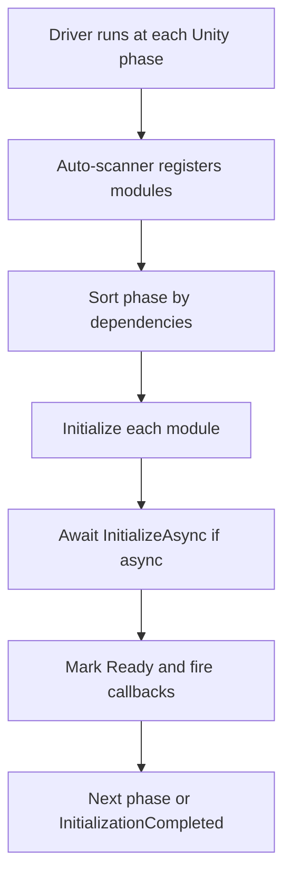

# AceLand Lifecycle
Deterministic, dependency-ordered global initialization and a unified quit pipeline for Unity.

## In One Line
Your app lives and dies on my schedule.

## Overview
`AceLand.Lifecycle` replaces the scattered mix of `[RuntimeInitializeOnLoadMethod]`, `Awake` and `Start`
that most projects use for bootstrapping. Each module simply declares **which phase it belongs to** and
**what it depends on**; a topological sorter then decides the exact, deterministic execution order.

It also unifies application shutdown into a single **quit pipeline**: busy systems can hold the quit,
async wrap-up handlers run in a predictable order, every module is shut down in reverse, and only then
does the application actually exit — with timeouts that guarantee it never deadlocks.

A set of Editor windows visualise the Initialization Graph, the Initialization Timeline and the Quit Pipeline Graph,
so the whole lifecycle is inspectable rather than guessed at.

## Package Info
| |                                                                                                            |
| --- |------------------------------------------------------------------------------------------------------------|
| display name | AceLand Lifecycle                                                                                          |
| package name | com.aceland.lifecycle                                                                                      |
| latest version | 0.3.0                                                                                                      |
| namespace | AceLand.Lifecycle                                                                                          |
| git repository | [https://github.com/parsue/com.aceland.lifecycle.git](https://github.com/parsue/com.aceland.lifecycle.git) |
| unity | 2022.3 or newer                                                                                            |
| dependencies | none                                                                                                       |

---

## Why Use It
- **Deterministic order** — the same dependency graph always produces the same boot order, on every machine and every run.
- **Declarative** — an attribute states intent; you never hand-wire call order or juggle `Awake` timing.
- **Dependencies stay honest** — you point at real types with `typeof(...)`, so a code reference, the asmdef reference and the package dependency all stay consistent automatically.
- **Async without chaos** — async modules are awaited in order, and opt-in parallelism lets independent modules warm up concurrently.
- **A real shutdown story** — one quit entry point handles the Editor and builds alike: wait for busy systems, run wrap-up handlers, shut everything down, then exit. Timeouts mean it never hangs.
- **Inspectable** — Editor windows show the Initialization Graph, the Initialization Timeline and the Quit Pipeline Graph.
- **Safe by design** — every static resets cleanly, so it behaves correctly whether or not Domain Reload is disabled.

---

## How It Works
The lifecycle runs in four strictly ordered phases. A phase begins only after the previous one has fully finished.

| Phase | Unity timing | Use for |
| --- | --- | --- |
| `Core` | AfterAssembliesLoaded | Pure C#; no UnityEngine objects |
| `Runtime` | BeforeSceneLoad | UnityEngine APIs available, no scene objects yet |
| `Scene` | AfterSceneLoad | Needs an existing scene / creates GameObjects |
| `Late` | after AfterSceneLoad | Final wrap-up: analytics, warm-up, intro flow |

Within a phase, the order is decided by dependencies (via `DependsOn`), with `Order` as a tie-break.
The attribute only **registers** the module — it never decides order by itself.



Only assemblies marked with `[assembly: LifecycleAssembly]` are scanned, so startup never reflects over the whole project.

---

## Quick Start

### 1. Opt the assembly in
Add this once per assembly that contains modules (for example in an `AssemblyInfo.cs`):

```csharp
using AceLand.Lifecycle;

[assembly: LifecycleAssembly]
```


Forget this and your modules simply never run — startup only scans assemblies that carry
`[assembly: LifecycleAssembly]`. If a module seems to be ignored, check this marker first.


### 2. Write a module
A synchronous module derives from `ModuleBase` and declares its phase.



```csharp
using AceLand.Lifecycle;
using UnityEngine;

[LifecycleModule(ModulePhase.Core, Order = -5000)]
public sealed class GameSettings : ModuleBase
{
    public string GameName { get; private set; }

    public override void Initialize()
    {
        GameName = "My Game";
        Debug.Log("GameSettings ready");
    }

    public override void Shutdown()
    {
        GameName = null;
    }
}
```



```csharp
using System.Threading;
using System.Threading.Tasks;
using AceLand.Lifecycle;

// Depends on GameSettings, so it always runs after it.
[LifecycleModule(ModulePhase.Core, DependsOn = new[] { typeof(GameSettings) })]
public sealed class RemoteConfigModule : AsyncModuleBase
{
    public override async Task InitializeAsync(CancellationToken cancellationToken)
    {
        var settings = await ModuleRegistry.WhenReadyAsync<GameSettings>(cancellationToken);
        // ... load remote config for settings.GameName ...
        await Task.Delay(500, cancellationToken);
    }
}
```



That is all — the module is discovered and run automatically in the correct order. No manual registration needed.

### 3. Consume a module from anywhere
```csharp
// Fire a callback the moment the module is ready (runs immediately if already ready).
ModuleRegistry.WhenReady<GameSettings>(settings =>
{
    Debug.Log($"Using {settings.GameName}");
});

// Or await it.
var settings = await ModuleRegistry.WhenReadyAsync<GameSettings>();
```

---

## Learn More
- [Defining and Running Modules](modules.md) — phases, dependencies, async, parallelism and querying.
- [The Quit Pipeline](quit-pipeline.md) — quit handlers, blockers and the lifecycle tokens.
- [Frame Scheduling](frame-scheduling.md) — run work on the player loop without a MonoBehaviour.
- [Player Loop](player-loop.md) — the eight injection points and how ticks are installed into Unity's loop.
- [Cancellation](cancellation.md) — the lifecycle tokens, linked sources and frame-scoped waits.
- [Editor Tools and Profiling](editor-tools.md) — the Initialization Graph, Initialization Timeline and export.

---

## Best Practices
- Keep `Initialize()` lightweight — register services and set fields; push heavy work into `InitializeAsync`.
- Make `Shutdown()` re-entrant; it may be called more than once and must never throw on a second call.
- Depend on the earliest phase that still satisfies your needs — do not push everything into `Late`.
- Never let a synchronous module depend on an async module (the Validator will flag it); make the dependent async too.
- Mark every module-bearing assembly with `[assembly: LifecycleAssembly]`.
- Use `WhenReady<T>` / `WhenReadyAsync<T>` for late subscribers instead of the one-shot events.
