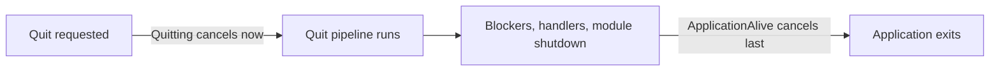

# Cancellation

Stop your work at exactly the right moment during shutdown.

## Overview
Long-running work — game loops, polling, network calls, animations — must know when to stop. Instead of
inventing your own flags, `AceLand.Lifecycle` gives you two ready-made `CancellationToken`s tied to the
application's real lifecycle, plus safe helpers to link your own tokens and to wait across frames.

Everything here lives on the static `LifecycleToken` hub. You never construct a
`CancellationTokenSource` for the lifecycle yourself; you either read a token or ask the hub to hand you
a linked, self-cleaning source.

---

## Two Tokens
There are two lifecycle tokens, and picking the right one is the whole game.

| Token | Cancelled when… | Use it for |
| --- | --- | --- |
| `Quitting` | The moment a quit is **requested** | Work that should stop *immediately*: game loops, polling, animations |
| `ApplicationAlive` | Only after the **whole quit pipeline finishes** | The shutdown work itself: waiting on blockers, unloading scenes, writing files |




Rule of thumb: use `Quitting` to **stop gameplay fast**, and `ApplicationAlive` to **keep shutdown work
alive** until everything is truly done. Cancelling shutdown work on `Quitting` would kill the very code
that is supposed to run *during* quit.


Convenience members mirror the tokens:

```csharp
if (LifecycleToken.IsQuitting) return;      // a quit has been requested
if (!LifecycleToken.IsAlive) return;        // the pipeline has fully finished
```

---

## Guarding Work
For synchronous code that must not run after shutdown, `ThrowIfDead()` is the shortest guard — it does
nothing while alive and throws `OperationCanceledException` once the application is dead.

```csharp
public void Tick()
{
    LifecycleToken.ThrowIfDead();   // bail out cleanly if we are past shutdown
    // ... normal per-frame work ...
}
```

For async work, pass a lifecycle token straight into the API you are already using:

```csharp
// Stops the moment a quit is requested.
await Task.Delay(1000, LifecycleToken.Quitting);
```

---

## Linked Sources
When you need to combine a lifecycle token with your *own* cancellation (a timeout, a per-request token),
ask the hub for a `LinkedTokenSource`. It is always linked to the lifecycle for you, and it converts
implicitly to a `CancellationToken`, so it drops straight into existing APIs.

| Factory | Linked to | Extra |
| --- | --- | --- |
| `CreateLinked(...)` | `ApplicationAlive` | Optional other tokens |
| `CreateLinked(timeout, ...)` | `ApplicationAlive` | Auto-cancels after a timeout |
| `CreateQuitLinked(...)` | `Quitting` | Optional other tokens |
| `CreateQuitLinked(timeout, ...)` | `Quitting` | Auto-cancels after a timeout |



```csharp
// Linked to ApplicationAlive: cancels when shutdown fully completes.
using var link = LifecycleToken.CreateLinked();
await DoWorkAsync(link.Token);   // or just DoWorkAsync(link) via the implicit conversion
```



```csharp
// Cancels after 5s OR when the application dies, whichever comes first.
using var link = LifecycleToken.CreateLinked(TimeSpan.FromSeconds(5));
await FetchAsync(link.Token);
```



```csharp
// A game loop that must stop the instant a quit is requested.
using var link = LifecycleToken.CreateQuitLinked();
while (!link.IsCancellationRequested)
{
    Step();
    await LifecycleToken.WaitForNextFrame(link.Token);
}
```




Always dispose a `LinkedTokenSource` — wrap it in `using` or call `Dispose()`. Undisposed sources pile
registrations onto the main lifecycle CTS. With Domain Reload disabled they survive between play
sessions; `ResetStatics` will forcibly reclaim them and log a warning telling you how many leaked.


---

## Frame-Scoped Waits
`LifecycleToken` also exposes awaitable waits driven by the frame pump. Each returns an
[`IFrameHandle`](frame-scheduling.md) you can `await` (or dispose to cancel). **Every** wait is linked
with `ApplicationAlive`, so it can never leave you hanging after shutdown, even if you pass no token.

| Helper | Resumes when… |
| --- | --- |
| `WaitForNextFrame()` | The next frame pump |
| `WaitForFrames(n)` | After `n` frames |
| `WaitForSeconds(s)` | After `s` seconds (scaled; pass `unscaled: true` for real time) |
| `WaitUntil(predicate)` | The predicate becomes `true` |
| `WaitWhile(predicate)` | The predicate becomes `false` |

```csharp
// Wait until the player is grounded, then act — no coroutine, no MonoBehaviour.
await LifecycleToken.WaitUntil(() => player.IsGrounded);
Land();
```

You can also mint a token that auto-cancels after a number of frames, handy for "valid for this frame
only" scopes:

```csharp
using var frameToken = LifecycleToken.CreateCurrentFrameToken(); // cancels at end of this frame
Prepare(frameToken.Token);
```


These waits are polled **once per frame on the Unity main thread**, and resume on the main thread too.
They are for main-thread game logic — do not call them from a background thread. For off-thread work,
pass `Quitting` / `ApplicationAlive` into a normal `Task`-based API instead.


---

## Best Practices
- Choose deliberately: `Quitting` to **stop gameplay now**, `ApplicationAlive` to **finish shutdown**.
- Never cancel shutdown work on `Quitting` — it would kill the code meant to run during quit.
- Always `using` your `LinkedTokenSource` to avoid leaks when Domain Reload is off.
- Prefer the frame-scoped waits over hand-rolled coroutines for main-thread timing; they cancel on quit
  automatically.
- Keep frame-scoped waits on the main thread; route background work through the raw tokens instead.

---

## See Also
- [The Quit Pipeline](quit-pipeline.md) — what actually happens between a quit request and exit.
- [Frame Scheduling](frame-scheduling.md) — the `IFrameHandle` and the frame pump these waits ride on.
- [Player Loop](player-loop.md) — where in the frame the waits are polled.
