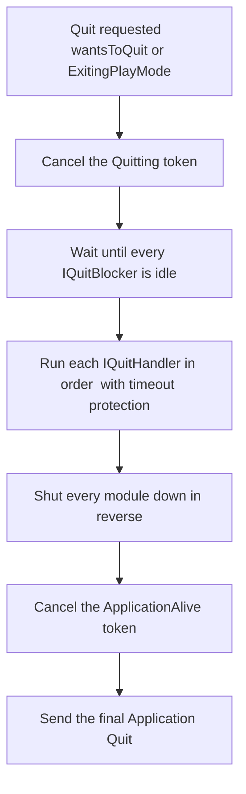

# The Quit Pipeline

Shutting down cleanly is as important as starting up cleanly. `AceLand.Lifecycle` funnels every exit —
in the Editor and in builds — through a single, predictable pipeline that waits for busy systems, runs
your async wrap-up handlers in order, shuts every module down in reverse, and only then lets the
application actually exit. Timeouts guarantee it never deadlocks.

## The Pipeline at a Glance



Two ideas make this safe:

- **Blockers** answer *may we quit yet?* — the pipeline waits while any system is busy.
- **Handlers** answer *what must happen before we go?* — async wrap-up work, run in a defined order.

---

## Async Wrap-Up: `IQuitHandler`

Implement `IQuitHandler` on a module to run asynchronous work before the application exits — flushing
saves, closing connections, uploading analytics. Handlers are collected automatically and, by default,
run in the **reverse** order of initialization.

```csharp
using System.Threading.Tasks;
using AceLand.Lifecycle;

[LifecycleModule(ModulePhase.Runtime)]
[QuitOrder(-100)] // lower runs first; unmarked handlers are 0
public sealed class SaveOnQuitModule : ModuleBase, IQuitHandler
{
    public async Task OnBeforeQuitAsync(QuitContext context)
    {
        context.SetStatus("Saving game...");

        // context.Token is the ApplicationAlive token — still alive during shutdown,
        // so it is safe to await against.
        await SaveAllAsync(context.Token);

        context.SetStatus("Saved.");
    }
}
```

`[QuitOrder(order)]` overrides the position: **lower runs first**. Unmarked handlers stay at `0`, keeping
the reverse-initialization order.

---

## The `QuitContext`

Each handler receives a `QuitContext` describing the shutdown in progress.

| Member | Meaning |
| --- | --- |
| `Token` | The `ApplicationAlive` token — still alive during shutdown, safe to `await` against |
| `StartedAtUtc` | When the quit pipeline started |
| `TimeoutSeconds` | Overall budget; `<= 0` means infinite |
| `HasTimeout` | `true` when a positive timeout is set |
| `Elapsed` | Time since the pipeline started |
| `Remaining` | Time left before the overall timeout (`TimeSpan.MaxValue` when infinite) |
| `IsTimedOut` | `true` once the overall budget is exhausted |
| `Status` | Current status text |
| `SetStatus(text)` | Updates the status and broadcasts `ApplicationQuitPipeline.StatusChanged` |

Use `SetStatus(...)` to drive a "Saving…" overlay or toast, and check `Remaining` / `IsTimedOut` to keep
long work inside budget.

---

## Holding the Quit: `IQuitBlocker`

Sometimes you must not exit yet — a transaction is mid-flight, a file is being written. Implement
`IQuitBlocker`: before running any handler, the pipeline polls all blockers and waits until every one
reports idle.

```csharp
using AceLand.Lifecycle;

[LifecycleModule(ModulePhase.Runtime)]
public sealed class UploadQueueModule : ModuleBase, IQuitBlocker
{
    private int _pending;

    public bool IsBusy => _pending > 0;
    public string BusyReason => $"Uploading {_pending} item(s)";
}
```

`BusyReason` is shown in the Editor's Quit Pipeline Graph, so a stuck shutdown is easy to diagnose.


The overall pipeline timeout still applies — blockers **cannot** hang the pipeline forever. If a
blocker stays busy past the timeout, the quit is forced forward regardless.


---

## Lifecycle Tokens

`QuitContext.Token` is the `LifecycleToken.ApplicationAlive` token: it stays alive for the whole
shutdown window, so your quit handlers can safely await against it.


Two global cancellation tokens track the app's real lifespan — `Quitting` (fires the moment a quit is
requested) and `ApplicationAlive` (fires only after the pipeline finishes). See
[Cancellation](cancellation.md) for the full model, guards and linked sources.


---

## Best Practices

- Do async cleanup in `OnBeforeQuitAsync` and always await against `context.Token`.
- Use `SetStatus(...)` to surface progress in UI and in the Quit Pipeline Graph.
- Keep handlers within budget — check `context.Remaining` / `context.IsTimedOut` for long work.
- Use `IQuitBlocker` for transient "busy" states; give a clear `BusyReason`.
- For your own long-running tasks, link with `CreateLinked` / `CreateQuitLinked` (see [Cancellation](cancellation.md)) so they stop on shutdown.
- Do not rely on `OnApplicationQuit` ordering — let the pipeline sequence shutdown for you.
